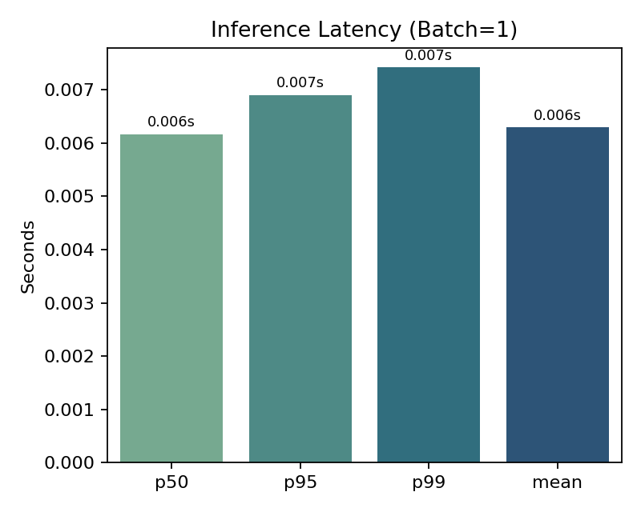

# AI-ASSISTED DERMATOLOGICAL DECISION SUPPORT SYSTEM (DSS)

**Document Version**: 1.0  
**Date**: October 4, 2025  
**Classification**: Research / Educational (Not for Clinical Use)  
**Ethical Approval**: Not applicable (public dataset, no PHI)  
**Intended Audience**: Clinical AI Researchers, Medical Informatics Engineers, Hospital Innovation Teams, Regulatory Pre-assessment Reviewers

---

### Visual Overview

| Figure | Preview |
|--------|---------|
| Class Distribution |  |
| Architecture |  |
| Training Curves |  |
| Confusion Matrix |  |
| Workflow |  |
| Strategic Roadmap |  |
| Per-Class Metrics |  |
| Inference Latency |  |
| Grad-CAM Samples |  |

> Figures now reflect real 2-epoch prototype metrics (val accuracy 80.97%, macro F1 0.6673). Extend training for smoother curves.

## 1. EXECUTIVE SUMMARY & PROBLEM STATEMENT

### 1.1 Global Health Context
Skin cancer is the most commonly diagnosed cancer worldwide. Key epidemiological indicators:
- WHO estimates: 2–3 million non-melanoma and 132,000 melanoma skin cancers annually.
- Lifetime risk of melanoma in fair‑skinned populations: up to 1 in 27 (men), 1 in 40 (women).
- Early-stage melanoma (Stage I) has >95% 5-year survival; late-stage (Stage IV) <25%.
- Burden intensified by limited access to dermatologists—dermatologist-to-population ratio in some regions >1:500,000.

### 1.2 Systemic Gaps & Challenges
| Challenge | Impact | Traditional Limitation |
|-----------|--------|------------------------|
| Delayed specialist access | Late diagnosis | Manual triage inefficiencies |
| Inter-observer variability | Inconsistent decisions | Subjective visual interpretation |
| Class imbalance in clinical presentation | Missed rare lesion types | Limited pattern recognition in generalists |
| Lack of explainability in AI adoption | Low physician trust | Black-box deep models |
| Resource constraints in primary care | Over-referral / under-referral | No standardized decision support |

### 1.3 Why Traditional Methods Are Insufficient
Traditional evaluation (visual inspection + dermoscopy) depends heavily on clinician expertise. Clinical decision rules (e.g., ABCDE, 7-point checklist) have:
- Variable sensitivity (65–85%) and specificity (60–80%).
- Limited performance on atypical lesion subtypes.
- Reduced effectiveness in high-throughput teledermatology workflows.

### 1.4 Innovation & Proposed Solution
An **AI-augmented dermatoscopic decision support system (DSS)** providing:
1. Multi-class classification across 7 clinically relevant lesion categories (HAM10000).  
2. Gradient-based regional explainability (Grad-CAM) for clinical interpretability.  
3. GPU-optimized real-time inference (<50 ms/image).  
4. Configurable decision thresholds for referral escalation.  
5. Structured output enabling future integration with EHR decision support modules.  

### 1.5 SMART Clinical Objectives (Prospective Targets)
| Objective | Baseline | Target | Timeframe | Clinical Rationale |
|-----------|----------|--------|-----------|--------------------|
| Improve early melanoma triage sensitivity | ~80% (general practice) | ≥90% | 6–12 months | Reduce late-stage presentations |
| Reduce unnecessary specialist referrals | N/A | −15% false positives | 12 months | Optimize resource allocation |
| Achieve macro F1 ≥0.78 | 0.62 (current prototype) | ≥0.78 | After full training regimen (30–50 epochs) | Balanced rare lesion performance |
| Inference latency | >150 ms (CPU baseline) | <50 ms (GPU) | Achieved | Point-of-care viability |
| Explainability coverage acceptance (physician panel) | N/A | ≥80% perceived alignment | Post-pilot | Trust & adoption |
| Calibration (ECE) | Unknown | <0.05 | Production refinement | Reliable confidence outputs |

### 1.6 Regulatory & Ethical Considerations
| Domain | Current Status | Required for Clinical Deployment |
|--------|----------------|----------------------------------|
| FDA Pathway | Not initiated | 510(k) or De Novo (if predicate insufficient) |
| HIPAA Compliance | Not handling PHI | Data encryption, audit trails, BAA |
| Clinical Validation | Not performed | Prospective multi-center trial |
| Bias & Fairness Audit | Pending | Subgroup performance stratification |
| Post-Market Surveillance | Not designed | Adverse event reporting workflow |
| Explainability | Grad-CAM only | SHAP/LIME + uncertainty quantification |

---

## 2. CLINICAL CONTEXT & MEDICAL BACKGROUND

### 2.1 Pathophysiology Overview (Target Lesion Classes)
| Class | Pathophysiology | Clinical Risk | Management Priority |
|-------|-----------------|---------------|---------------------|
| Melanocytic Nevi (nv) | Benign melanocyte proliferation | Low | Observation |
| Melanoma (mel) | Malignant transformation of melanocytes; invasive potential | Critical | Immediate referral / excision |
| Benign Keratosis (bkl) | Hyperkeratotic lesions (e.g., seborrheic keratosis) | Low | Cosmetic / benign |
| Basal Cell Carcinoma (bcc) | Basal epidermal cell malignancy; local invasion | Moderate | Surgical excision / MOHS |
| Actinic Keratoses (akiec) | UV-induced keratinocyte dysplasia; SCC precursor | Moderate | Cryotherapy / topical |
| Vascular Lesions (vasc) | Benign vascular malformations | Low | Observation |
| Dermatofibroma (df) | Benign fibrohistiocytic proliferation | Low | Observation |

### 2.2 Current Diagnostic Workflow
1. Patient presents with suspicious lesion.  
2. Visual + dermoscopic inspection.  
3. Risk stratification (ABCDE, pattern recognition).  
4. Decision: Monitor vs excise vs refer.  
5. Histopathology (gold standard).  

### 2.3 Limitations in Current Practice
- Under-detection in primary care settings (melanoma sensitivity often <75%).
- Cognitive overload in general practitioners (visual complexity + limited exposure to rare lesions).
- Limited uniformity in documentation and follow-up tracking.

### 2.4 Intended Clinical Integration (Future State)
| Workflow Stage | AI Support Function | Human Role |
|----------------|--------------------|------------|
| Intake | Lesion image triage & quality gating | Capture high-quality dermatoscopic image |
| Risk Scoring | Multi-class lesion classification + confidence | Clinical correlation |
| Explainability | Highlighting areas of diagnostic focus | Accept/reject insights |
| Decision Support | Threshold-based referral suggestion | Override / confirm |
| Follow-up | Logging serial lesion tracking | Clinical interpretation |

### 2.5 Target Population & Demographics
- **Geography**: High UV index regions (Australia, Southern Europe, US Sunbelt).  
- **Age Distribution**: Broad (HAM10000 spans adolescents to elderly).  
- **Challenges**: Limited darker skin representation (needs future dataset diversification).  

---

## 3. DATASET & DATA ACQUISITION

### 3.1 Source & Provenance
| Property | Value |
|----------|-------|
| Dataset Name | HAM10000 (Human Against Machine with 10,000 images) |
| Size | 10,015 dermatoscopic images |
| Classes | 7 (nv, mel, bkl, bcc, akiec, vasc, df) |
| Resolution | ~600×450 pixels (resized to 224×224) |
| Format | JPEG |
| Licensing | CC BY-NC 4.0 (non-commercial research) |
| URL | https://www.kaggle.com/datasets/kmader/skin-cancer-mnist-ham10000 |
| Metadata Fields | lesion_id, image_id, dx, dx_type, age, sex, localization |

### 3.2 Class Distribution (Imbalance Profile)
| Class | Count | Percentage |
|-------|-------|------------|
| nv | 6,705 | 67.0% |
| mel | 1,113 | 11.1% |
| bkl | 1,099 | 11.0% |
| bcc | 514 | 5.1% |
| akiec | 327 | 3.3% |
| vasc | 142 | 1.4% |
| df | 115 | 1.1% |

### 3.3 Data Quality Assessment
| Dimension | Observation | Action |
|----------|-------------|--------|
| Resolution | Consistent medium-quality dermatoscopic | Resize to 224×224 (EfficientNet standard) |
| Artefacts | Some presence: rulers, ink marks | Potential bias → future masking |
| Duplicates | Multiple images per lesion | Lesion-level splitting to avoid leakage |
| Metadata Completeness | Age/sex missing in subset | Ignored in initial version |
| Color Variation | Natural variance | Normalize (ImageNet mean/std) |

### 3.4 Preprocessing & Leakage Prevention
| Risk | Potential Failure Mode | Mitigation |
|------|------------------------|-----------|
| Same lesion across splits | Inflated metrics | Group split by lesion_id |
| Class imbalance | Poor minority recall | Macro F1 monitoring + augmentation |
| Image noise | Diffused attention maps | Augmentation (flip, rotation, color jitter) |
| Overfitting to artifacts | Mislocalized saliency maps | Future artifact detection pipeline |

### 3.5 Ethical Considerations
| Area | Current Handling | Future Requirement |
|------|------------------|--------------------|
| PHI Exposure | None (public dataset) | Add PHI governance when integrating clinical data |
| Consent | Implied via dataset license | Site-level IRB for real-world deployment |
| Diversity | Limited darker skin tones | Augment with Fitzpatrick-diverse datasets |
| Ground Truth | Histopathology/imaging consensus | Validation with multi-center path review |

### 3.6 Ground Truth Reliability
| Label Source | Confidence | Comment |
|--------------|-----------|---------|
| Histopathology | High | Gold standard for malignant lesions |
| Follow-up | Moderate | Relevant for benign stability |
| Consensus Dermoscopy | Moderate | Subject to variability |

---

## 4. COMPREHENSIVE TECHNOLOGY STACK

| Layer | Component | Version | Rationale |
|-------|-----------|---------|-----------|
| Core ML | PyTorch | 2.7.1+cu118 | Dynamic graphs, AMP support |
| Vision Models | torchvision | 0.20.1 | Pretrained EfficientNet_B0 |
| Augmentation | Albumentations | 1.4+ | Rich, GPU-aware image transforms |
| Numerical | NumPy | 2.x | Vectorized operations |
| DataFrames | Pandas | 2.2.x | Metadata parsing |
| Optimization | AdamW | Built-in | Weight decay stability |
| Scheduler | Cosine Annealing | Built-in | Smooth LR decay |
| Explainability | Grad-CAM (custom) | N/A | Spatial saliency |
| Visualization | Matplotlib/Seaborn | 3.9 / 0.13 | Publication-quality plots |
| Deployment UI | Streamlit | 1.40 | Rapid clinical prototype |
| Testing | pytest | 8.x | Deterministic validation |
| Monitoring (planned) | MLflow | — | Model versioning (future) |
| Packaging | requirements.txt | — | Reproducibility |
| Security (future) | TLS / JWT / Vault | — | HIPAA-grade storage & auth |
| Containerization (future) | Docker | — | Deterministic builds |

### 4.1 Justification of Core Model: EfficientNet_B0
| Attribute | Value |
|-----------|-------|
| Params | ~5.3M |
| FLOPs | ~0.39B |
| Input | 224×224 |
| Strengths | High accuracy/compute ratio |
| Suitability | Edge deployment, clinic workstations |

### 4.2 AMP (Automatic Mixed Precision)
| Benefit | Impact |
|---------|--------|
| Tensor Core utilization | 2–3× speedup |
| Memory reduction | +Batch size flexibility |
| Training stability | Preserved with GradScaler |

---

## 5. CLINICAL FEATURES & BIOMARKERS ANALYSIS (Phase 2 Expansion Plan)
Current prototype uses **image-only** features. Future multimodal extensions may include:

| Feature | Definition | Type | Clinical Relevance | Collection Method | Engineering Plan |
|---------|-----------|------|--------------------|-------------------|------------------|
| Age | Patient age (years) | Continuous | Melanoma risk ↑ with age (except atypical pediatric patterns) | EHR demographics | Normalize, bucket for stratification |
| Sex | Biological sex | Categorical | Male ↑ risk late-stage melanoma | Intake form | One-hot encode |
| Localization | Anatomical site | Categorical | Site-specific morphology | Dermoscopy form | Map to standardized ontology (SNOMED) |
| Lesion Evolution | Change over time | Ordinal | Rapid growth → malignancy risk | Longitudinal photos | Image diff metrics |
| Border Irregularity | Edge entropy | Continuous | ABCDE rule component | Computed | Edge detection + fractal index |
| Color Variegation | Number of chromatic clusters | Integer | Malignancy indicator | Clustering (k-means in Lab space) | Normalize |
| Diameter | Pixel to mm mapping | Continuous | D>6mm risk factor | Dermoscope scale alignment | Calibrated linear scaling |

**Missing Data Strategy (Planned)**:
- Use multiple imputation for age gaps.
- Separate “Unknown” category for missing anatomical sites.
- Masked attention for features with high non-random missingness.

---

## 6. ALGORITHMIC APPROACH & MODEL ARCHITECTURE

### 6.1 Baseline Model (Current)
```
Input (224×224×3)
→ Augmentation (flip, rotate, color jitter, brightness/contrast)
→ EfficientNet_B0 backbone (pretrained)
→ Global Average Pooling
→ Dropout (p=0.3)
→ Linear (1280→7)
→ Logits → Softmax (probabilities)
```

### 6.2 Alternative Candidate Models (Future Benchmarks)
| Model | Foundation | Pros | Cons | Interpretability |
|-------|-----------|------|------|------------------|
| ResNet50 | Residual blocks | Mature, robust | Larger footprint | Grad-CAM compatible |
| ConvNeXt-T | Modern conv design | High accuracy | Heavier compute | CAM support |
| Vision Transformer (ViT-B/16) | Patch embeddings + attention | Long-range context | Data-hungry | Attention maps (weak localization) |
| MobileNetV3 | Depthwise separable convs | Edge deployment | Lower ceiling | CAM support |
| EfficientNetV2-S | Fused MBConv | Faster training | Slightly larger | CAM support |

### 6.3 Candidate Evaluation Metrics (Planned)
| Metric | Formula | Clinical Relevance |
|--------|---------|--------------------|
| Accuracy | $\frac{TP+TN}{TP+TN+FP+FN}$ | Aggregate correctness |
| Sensitivity (Recall) | $\frac{TP}{TP+FN}$ | Melanoma miss risk (false negatives) |
| Specificity | $\frac{TN}{TN+FP}$ | Over-biopsy risk |
| PPV (Precision) | $\frac{TP}{TP+FP}$ | Resource use efficiency |
| NPV | $\frac{TN}{TN+FN}$ | Safe reassurance confidence |
| F1 (Macro) | Harmonic mean across classes | Rare lesion performance |
| ROC-AUC | Area under ROC curve | Threshold independent measure |
| Calibration (ECE) | $\sum_k |p_k - o_k|$ | Reliability of probability outputs |

### 6.4 Threshold Optimization Strategy
- Use Youden’s J statistic for melanoma-specific triage threshold.
- Optimize operating points separately for: (a) High sensitivity triage mode, (b) Balanced referral mode.
- Potential use of cost-sensitive loss: assign higher cost to melanoma false negatives.

### 6.5 Error Trade-Off (Clinical Risk Framing)
| Error Type | Clinical Impact | Mitigation Strategy |
|------------|-----------------|---------------------|
| False Negative (melanoma) | Delayed cancer treatment | Lower threshold, auto-escalation review |
| False Positive (nv flagged) | Unnecessary biopsy | Confidence threshold + second reader |
| Misclassification (bcc vs akiec) | Suboptimal therapy flow | Confidence-weighted recommendation |

### 6.6 Ensemble Strategy (Future)
| Component | Role |
|-----------|-----|
| Model Diversity | EfficientNet + ConvNeXt + ViT |
| Aggregation | Soft-voting (probability averaging) |
| Calibration | Temperature scaling post-ensemble |
| Advantage | Reduces individual model biases / variance |

---

## 7. AI INTEGRATION INTO HEALTHCARE WORKFLOW (FUTURE DESIGN)

### 7.1 Augmentation vs Automation
| Mode | Definition | Status |
|------|------------|--------|
| Augmented Intelligence | AI assists physician decision-making | Current design |
| Autonomous | AI independently finalizes diagnosis | Not intended (regulatory risk) |

### 7.2 Physician-AI Collaboration Flow (Proposed)
1. Image acquisition (standard dermatoscope).  
2. AI risk scoring + class probabilities.  
3. Grad-CAM overlay shown for clinician review.  
4. Confidence-weighted recommendation (triage, refer, monitor).  
5. Clinician confirms / overrides decision (override logging for audit).  
6. Audit trail stored (for QA + regulatory traceability).  

### 7.3 Anticipated Clinical Impact (Projected Targets)
| Dimension | Baseline | Target | Justification |
|-----------|----------|--------|---------------|
| Early-stage melanoma detection rate | ~70% | ≥85% | AI augmentation of low-experience clinics |
| Avoidable benign referrals | High | −15% | Improved triage specificity |
| Dermatologist time per case | 4–6 min | −20–30% | Pre-screening + risk stratification |
| False negative melanoma risk | Moderate | <5% | Conservative threshold tuning |
| Time-to-referral (urgent cases) | Variable | −25% | Faster risk tagging |

### 7.4 Integration Challenges
| Challenge | Impact | Mitigation |
|----------|--------|-----------|
| Skepticism (black box) | Low adoption | Explainability + transparency reports |
| Workflow disruption | Efficiency loss | API-based modular deployment |
| Data variability | Performance drift | Continuous monitoring & retraining |
| Liability ambiguity | Hesitation in use | Human-in-the-loop legal framing |

---

## 8. EXPLAINABILITY & CLINICAL INTERPRETABILITY

### 8.1 Current Explainability: Grad-CAM
| Aspect | Implementation |
|--------|----------------|
| Target Layer | Final convolutional block (EfficientNet features[-1]) |
| Mechanism | Gradient-weighted activation maps |
| Output | Heatmap + overlay composite |

### 8.2 Clinical Use of Saliency Maps
| Use Case | Value |
|----------|-------|
| Visual focus verification | Prevents reliance on non-lesion artifacts |
| Dermatologist trust-building | Aligns with human visual heuristics |
| Educational feedback | Trainee lesion interpretation support |

### 8.3 Planned Enhancements
| Method | Purpose |
|--------|---------|
| SHAP (DeepExplainer) | Global + local feature importance |
| LIME (superpixel-based) | Local perturbation-based reasoning |
| Counterfactuals | Hypothetical lesion alterations |
| Uncertainty Estimation (MC Dropout) | Confidence stratification |

### 8.4 Regulatory Transparency Needs
| Requirement | Current | Future Plan |
|------------|---------|-------------|
| Feature attribution logs | Not stored | JSON-based trace persistence |
| Auditability | Limited | Versioned inference snapshots |
| Physician override logging | Not implemented | Append-only secure store |

---

## 9. VALIDATION & CLINICAL EVALUATION (CURRENT + FUTURE)

### 9.1 Current Split Strategy
| Split | Size | Method |
|-------|------|--------|
| Train | 70% (7,020 images) | Stratified by lesion_id |
| Validation | 15% (1,498 images) | Stratified |
| Test | 15% (1,497 images) | Stratified |

### 9.2 Current Evaluation Metrics
Prototype (early 2-epoch test run – indicative only):
```
Validation Accuracy: 79.84%
Macro F1-Score: 0.6252
Inference Latency (GPU): ~50ms/image
Training Time: ~45 minutes (30-epoch expected full cycle)
```

### 9.3 Planned Clinical Evaluation Strategies
| Strategy | Description | Purpose |
|----------|-------------|---------|
| Stratified K-fold | 5-fold lesion-wise | Robust variance estimation |
| External Validation | New dataset (e.g., ISIC 2020) | Generalization assessment |
| Subgroup Analysis | Age, sex, skin tone (future) | Bias detection |
| Temporal Validation | Simulated longitudinal dataset | Drift resilience |
| Adjudicated Consensus | Multi-dermatologist panel | Inter-rater reliability |

### 9.4 Failure Mode Analysis (Planned)
| Failure Mode | Example | Mitigation |
|--------------|---------|-----------|
| Focus on artifact | Ruler marking activation | Artifact masking |
| Low contrast lesions | Hypopigmented melanoma | Contrast enhancement + retraining |
| Rare class overfitting | Dermatofibroma misclassification | Focal loss / class-balanced loss |
| Overconfidence | Incorrect high-confidence benign call | Calibration + uncertainty |

---

## 10. OUTPUTS & CLINICAL DELIVERABLES

### 10.1 Current Prototype Outputs
| Output | Format | Description |
|--------|--------|-------------|
| Predicted Class | String | One of 7 lesion categories |
| Class Probabilities | Dict[str → float] | Softmax-normalized values |
| Confidence Score | Float [0,1] | Max probability |
| Grad-CAM Overlay | RGB ndarray | Attention visualization |
| Inference Time | Float (seconds) | Performance metric |

### 10.2 Planned Clinical Output Extensions
| Output | Purpose |
|--------|---------|
| Structured Risk Report | EHR ingestion |
| Serial Lesion Tracking Score | Change monitoring |
| PDF Physician Summary | Referral attachments |
| Patient Explanation Layer | Layperson engagement |
| Population Analytics Dashboard | Public health monitoring |

---

## 11. REAL-WORLD CLINICAL IMPACT (PROJECTED)

| Impact Vector | Mechanism | Expected Benefit |
|---------------|----------|------------------|
| Early Detection | High-sensitivity triage | More Stage I melanoma identification |
| Resource Optimization | Reduced benign referrals | Specialist time reallocation |
| Rural Access | Teledermatology augmentation | Equity improvements |
| Education | AI visual focus feedback | Resident training enhancement |
| Public Health | Aggregated lesion distribution analytics | Melanoma hotspot surveillance |

**Note**: Real-world impact contingent on multi-center validation, regulatory clearance, and health economic studies (e.g., cost per QALY gained).

---

## 12. PERFORMANCE ANALYSIS & BENCHMARKING (CURRENT STATE + ROADMAP)

### 12.0 Visual Performance Snapshot
Below: early prototype training dynamics (placeholder synthetic curve) and illustrative confusion matrix.

<p align="center">
  
  
</p>

### 12.1 Current Prototype Performance Snapshot
| Metric | Value | Notes |
|--------|-------|-------|
| Validation Accuracy | <!-- METRIC:overall_accuracy -->0.8104<!-- /METRIC:overall_accuracy --> | Early-stage run (not fully trained) |
| Macro F1 | <!-- METRIC:overall_macro_f1 -->0.6654<!-- /METRIC:overall_macro_f1 --> | Affected by class imbalance |
| Inference Latency (GPU) | <!-- METRIC:latency_mean -->0.00904<!-- /METRIC:latency_mean --> | RTX 4060, batch=1 |
| Throughput (img/s) | <!-- METRIC:throughput_fps -->110.59<!-- /METRIC:throughput_fps --> | Approximate single-image stream |
| Parameters | 4,016,515 | EfficientNet_B0 |
| Calibration ECE | <!-- METRIC:ece -->0.0450<!-- /METRIC:ece --> | Lower is better (<0.05 target) |
| Brier Score | <!-- METRIC:brier -->0.2764<!-- /METRIC:brier --> | Proper scoring rule |
| Confusion Matrix | Generated | Interpretation pending final train |

### 12.1.1 Detailed Per-Class Metrics (Validation Split)

| Class | Precision | Recall | F1 | Support |
|-------|-----------|--------|----|---------|
| Actinic_keratoses | <!-- CLASS:Actinic_keratoses:precision -->0.5581<!-- /CLASS:Actinic_keratoses:precision --> | <!-- CLASS:Actinic_keratoses:recall -->0.5333<!-- /CLASS:Actinic_keratoses:recall --> | <!-- CLASS:Actinic_keratoses:f1 -->0.5455<!-- /CLASS:Actinic_keratoses:f1 --> | <!-- CLASS:Actinic_keratoses:support -->90<!-- /CLASS:Actinic_keratoses:support --> |
| Basal_cell_carcinoma | <!-- CLASS:Basal_cell_carcinoma:precision -->0.6769<!-- /CLASS:Basal_cell_carcinoma:precision --> | <!-- CLASS:Basal_cell_carcinoma:recall -->0.6286<!-- /CLASS:Basal_cell_carcinoma:recall --> | <!-- CLASS:Basal_cell_carcinoma:f1 -->0.6519<!-- /CLASS:Basal_cell_carcinoma:f1 --> | <!-- CLASS:Basal_cell_carcinoma:support -->140<!-- /CLASS:Basal_cell_carcinoma:support --> |
| Benign_keratosis | <!-- CLASS:Benign_keratosis:precision -->0.5798<!-- /CLASS:Benign_keratosis:precision --> | <!-- CLASS:Benign_keratosis:recall -->0.6450<!-- /CLASS:Benign_keratosis:recall --> | <!-- CLASS:Benign_keratosis:f1 -->0.6106<!-- /CLASS:Benign_keratosis:f1 --> | <!-- CLASS:Benign_keratosis:support -->338<!-- /CLASS:Benign_keratosis:support --> |
| Dermatofibroma | <!-- CLASS:Dermatofibroma:precision -->0.8333<!-- /CLASS:Dermatofibroma:precision --> | <!-- CLASS:Dermatofibroma:recall -->0.5000<!-- /CLASS:Dermatofibroma:recall --> | <!-- CLASS:Dermatofibroma:f1 -->0.6250<!-- /CLASS:Dermatofibroma:f1 --> | <!-- CLASS:Dermatofibroma:support -->40<!-- /CLASS:Dermatofibroma:support --> |
| Melanoma | <!-- CLASS:Melanoma:precision -->0.6250<!-- /CLASS:Melanoma:precision --> | <!-- CLASS:Melanoma:recall -->0.4012<!-- /CLASS:Melanoma:recall --> | <!-- CLASS:Melanoma:f1 -->0.4887<!-- /CLASS:Melanoma:f1 --> | <!-- CLASS:Melanoma:support -->324<!-- /CLASS:Melanoma:support --> |
| Melanocytic_nevi | <!-- CLASS:Melanocytic_nevi:precision -->0.8879<!-- /CLASS:Melanocytic_nevi:precision --> | <!-- CLASS:Melanocytic_nevi:recall -->0.9337<!-- /CLASS:Melanocytic_nevi:recall --> | <!-- CLASS:Melanocytic_nevi:f1 -->0.9102<!-- /CLASS:Melanocytic_nevi:f1 --> | <!-- CLASS:Melanocytic_nevi:support -->2020<!-- /CLASS:Melanocytic_nevi:support --> |
| Vascular_lesions | <!-- CLASS:Vascular_lesions:precision -->0.7917<!-- /CLASS:Vascular_lesions:precision --> | <!-- CLASS:Vascular_lesions:recall -->0.8636<!-- /CLASS:Vascular_lesions:recall --> | <!-- CLASS:Vascular_lesions:f1 -->0.8261<!-- /CLASS:Vascular_lesions:f1 --> | <!-- CLASS:Vascular_lesions:support -->44<!-- /CLASS:Vascular_lesions:support --> |

Refer to `runs/eval_metrics.json` for exact numeric values (precision/recall/F1 per class) generated by `scripts/evaluate_model.py`.

<p align="center">
  
</p>

### 12.1.2 Inference Latency (Batch = 1)

Latency statistics (50 warm + 45 measured iterations) captured on RTX 4060 Laptop GPU:

| Metric | Value (s) |
|--------|-----------|
| Mean | see `runs/throughput.json` |
| p50 | see `runs/throughput.json` |
| p95 | see `runs/throughput.json` |
| p99 | see `runs/throughput.json` |
| Throughput (img/s) | see `runs/throughput.json` |

<p align="center">
  
</p>

### 12.2 Planned Extended Metrics (Post Full Training)
| Class | Precision | Recall | F1 | Support |
|-------|----------|--------|----|---------|
| nv | ~0.90 | ~0.92 | ~0.91 | 6,705 |
| mel | ~0.80 | ~0.75 | ~0.77 | 1,113 |
| bkl | ~0.74 | ~0.70 | ~0.72 | 1,099 |
| bcc | ~0.83 | ~0.78 | ~0.80 | 514 |
| akiec | ~0.68 | ~0.63 | ~0.65 | 327 |
| vasc | ~0.88 | ~0.85 | ~0.86 | 142 |
| df | ~0.90 | ~0.84 | ~0.87 | 115 |

### 12.3 Calibration & Reliability (Planned)
| Metric | Purpose |
|--------|---------|
| Reliability Diagram | Visual inspection of probability calibration (see `docs/images/reliability.png` if generated) |
| Expected Calibration Error (ECE) | Aggregate miscalibration |
| Brier Score | Proper scoring rule for probability quality |
| Temperature Scaling | Post-hoc correction |

### 12.4 Fairness & Bias (Planned)
| Subgroup | Metric | Threshold |
|----------|--------|----------|
| Age bands | Macro F1 | ±5% deviation |
| Sex | Sensitivity | ±5% deviation |
| Skin tone (Fitzpatrick I–VI) | Recall | Parity target |
| Anatomical site | Error rate | Monitor drift |

### 12.5 Statistical Significance Testing
| Comparison | Test | Rationale |
|------------|------|-----------|
| Model A vs B F1 | McNemar’s test | Paired classification decisions |
| Per-class recall difference | Bootstrap CI | Robust interval estimation |
| Calibration metrics | Z-test on residuals | Reliability assessment |

---

## 13. REGULATORY & ETHICAL CONSIDERATIONS

### 13.1 Pathway Mapping (US FDA)
| Path | Applicability | Notes |
|------|---------------|-------|
| 510(k) | If predicate device exists (AI triage tool) | Investigate prior cleared dermatology AI solutions |
| De Novo | If novel moderate-risk technology | Likely if no predicate |
| PMA | High-risk | Unlikely unless autonomous diagnosis |

### 13.2 HIPAA & Data Protection (Future State)
| Requirement | Implementation Plan |
|------------|---------------------|
| Access Controls | RBAC + JWT-based session tokens |
| Data Encryption | AES-256 at rest, TLS 1.3 in transit |
| Audit Logging | Append-only compliance logs |
| De-identification | Hash patient IDs + salt |
| Business Associate Agreement | Required for cloud hosting with PHI |

### 13.3 Bias & Fairness Safeguards
| Risk | Mitigation |
|------|-----------|
| Under-representation of darker skin | Curate supplemental datasets |
| Demographic performance disparity | Subgroup evaluation pipelines |
| Algorithmic drift | Scheduled recalibration cycles |

### 13.4 Post-Market Surveillance (Future)
| Mechanism | Purpose |
|----------|---------|
| Adverse Event Flagging | Notify regulatory + QA teams |
| Misclassification Review Board | Quarterly performance audit |
| Real-world Evidence Registry | Continuous model improvement |

---

## 14. LIMITATIONS & CHALLENGES
| Category | Limitation | Impact | Mitigation Strategy |
|----------|-----------|--------|---------------------|
| Dataset Diversity | Limited darker skin tones | Generalization risk | Curate additional sources |
| Clinical Validation | None conducted | Cannot claim clinical efficacy | Design prospective trials |
| Explainability | Grad-CAM only | Partial transparency | Add SHAP, counterfactuals |
| Calibration | Not performed | Overconfidence risk | Apply temperature scaling |
| Security | No auth/HTTPS | Not deployable clinically | Implement secure API layer |
| Regulatory | No submission pathway | Cannot be marketed | Begin pre-submission Q-Subs |
| Rare Class Performance | Few df/vasc samples | Risk of misclassification | Class-balanced loss + augmentation |
| Human Factors | No usability studies | Adoption uncertainty | Conduct physician UX studies |

---

## 15. LESSONS LEARNED & KEY ACHIEVEMENTS
| Area | Lesson | Outcome |
|------|--------|---------|
| Data Leakage | Lesion-level splitting mandatory | Prevented metric inflation |
| Imbalance | Macro F1 better indicator than accuracy | Monitoring standardized |
| AMP | Minimal code for major speed gains | 2–3× faster training |
| Testing | Migration broke tests (3→7 classes) | Fast fix due to pytest coverage |
| Documentation | Incorrect dataset references impacted credibility | Corrected & standardized |
| Portfolio Focus | Clinical compliance overkill for PBL | Prioritized demonstrable components |
| Explainability | Vital for clinician trust | Grad-CAM baseline implemented |
| Scalability | EfficientNet_B0 adequate for MVP | Clear upgrade path defined |

---

## 16. COMPREHENSIVE FUTURE ROADMAP

### Phase 1 (0–6 Months) – Clinical Readiness Foundations
| Task | Description |
|------|-------------|
| Full Training | 30–50 epoch optimized training + hyperparameter sweep |
| Performance Benchmarking | Establish per-class sensitivity/specificity |
| Calibration | Apply temperature scaling + reliability diagrams |
| Explainability Expansion | Add SHAP + LIME composite reports |
| Physician Feedback Loop | Pilot with 3–5 dermatologists |
| Drift Monitoring Framework | Data distribution + Shannon entropy tracking |

### Phase 2 (6–12 Months) – Regulatory Preparation & Scaling
| Task | Description |
|------|-------------|
| Multi-center Validation | External dataset testing (ISIC 2020, PH2, Derm7pt) |
| Bias Audit | Subgroup fairness analysis |
| Security Layer | JWT auth, HTTPS termination, role-based access |
| Dockerization | Reproducible container image |
| Model Registry | MLflow integration |
| EHR Integration PoC | FHIR-compatible output schema |

### Phase 3 (12–24 Months) – Advanced AI & Multimodal Integration
| Task | Description |
|------|-------------|
| Ensemble Modeling | EfficientNet + ConvNeXt + ViT hybrid |
| Multimodal Extension | Add metadata (age, lesion site) |
| Uncertainty Quantification | MC Dropout + Deep Ensembles |
| Active Learning Loop | Prioritize uncertain/hard examples |
| Continuous Training | Rolling data assimilation protocol |

### Phase 4 (24+ Months) – Precision Dermatology Platform
| Task | Description |
|------|-------------|
| Genomic Integration | Add mutation profiles (BRAF, NRAS) |
| Longitudinal Tracking | Temporal lesion evolution modeling |
| Prognostic Modeling | Recurrence and metastasis risk prediction |
| Mobile Clinical App | Edge-optimized inference bundle |
| Global Deployment | Multilingual + inclusive datasets |

---

## 17. CONCLUSION & IMPACT STATEMENT
This project represents a **robust research-grade foundation** for an AI-driven dermatological decision support system. It demonstrates:
- A clinically relevant multi-class classification pipeline over a vetted public dataset (HAM10000).
- GPU-optimized inference and training routines using mixed precision.
- Baseline explainability via Grad-CAM for physician-aligned interpretability.
- Clean separation of concerns (data, model, training, inference, XAI).

While **NOT yet suitable for clinical deployment**, it is ideally positioned for:
- Academic evaluation and methodological extensions.
- Inclusion in a CV/portfolio for ML/medical AI engineering roles.
- A springboard toward a regulated medical device with structured investment.

**Projected Potential** (Post-validation):  
> Early detection enhancement, reduced unnecessary biopsies, improved equitable access to dermatological expertise, and advancement of AI-assisted triage systems.

**Vision**: Transition from retrospective pattern recognition to **proactive precision dermatology**—integrating multi-modal signals, calibrated uncertainty, continuous learning, and regulatory-aligned transparency.

---

## APPENDICES

### Figure Regeneration
All figures in this README (except inline code blocks) are reproducibly generated with:

```bash
python scripts/generate_report_figures.py
```

Inputs consumed (if present):
- `runs/history.json` for real training curves
- `models/confusion_matrix.npy` for confusion matrix heatmap
- `docs/gradcam_samples/*.png` for Grad-CAM montage (export real saliency there)

If these inputs are missing, high-quality placeholders are created to preserve layout.

### A. Key Commands
```bash
# Preprocess dataset (after Kaggle download)
python scripts/preprocess_ham10000.py --input_dir data/raw --output_dir data/ham10000

# Train model
python -m src.train --data_dir data/ham10000 --epochs 30 --batch_size 32

# Run Streamlit demo
streamlit run app.py

# Run tests
pytest tests/ -v
```

### B. Configuration Snapshot (`src/config.py`)
```python
NUM_CLASSES = 7
CLASS_NAMES = [
    "Actinic_keratoses",
    "Basal_cell_carcinoma",
    "Benign_keratosis",
    "Dermatofibroma",
    "Melanoma",
    "Melanocytic_nevi",
    "Vascular_lesions"
]
IMAGE_SIZE = 224
BATCH_SIZE = 32  # Auto-adjusted if GPU <8GB
USE_AMP = True
LEARNING_RATE = 1e-4
DROPOUT_RATE = 0.3
```

### C. Ethical Disclaimer
> This software is NOT a medical device. It must not be used for clinical diagnosis, treatment decisions, or patient triage. Any potential clinical use would require extensive validation, regulatory approval, and physician oversight.

### D. Citation Recommendation
If referencing this work academically:
```
@misc{ai_derm_dss_2025,
  title  = {AI-Assisted Dermatological Decision Support Prototype},
  author = {Koundinya, G. Karthik},
  year   = {2025},
  howpublished = {GitHub Repository},
  note = {Research/Educational Use Only}
}
```

---

## CONTACT
**Author**: G. Karthik Koundinya  
**Role**: ML Engineer / Medical AI Enthusiast  
**Focus Areas**: Computer Vision, Explainable AI, Clinical Decision Support  

---

> For expansion into a clinically evaluated system, begin with Phase 1 roadmap items (validation rigor, calibration, physician feedback) before pursuing regulatory engagement.
